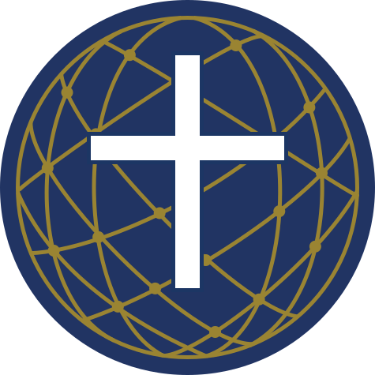

# Symbolism of the CDCF Logo

## The central vision: _Christus Rex_

The foundational concept of the Catholic Digital Commons Foundation logo is the enduring sovereignty of Christ, visually expressed by the **Cross superimposed upon a Globe**. This
core image declares a single theme: **Christ is King**—His dominion is universal, and His mission extends to the whole world.

The **Cross of Christ** is the supreme symbol of God's sacrificial love and the instrument of humanity's redemption. Its placement over the globe signifies that Christ's Kingship
is not confined to a single nation, people, or era, but is universal and absolute. The authority of Christ, established through His death and resurrection, extends over all
creation, all of history, and all of humanity.

This image also recalls the vision of Emperor Constantine before the Battle of the Milvian Bridge in 312 AD, when he saw the Cross in the sky with the words _"In hoc signo
vinces"_—"In this sign you shall conquer." That vision marked a turning point in history: Constantine's subsequent embrace of Christianity opened the way for the faith to spread
freely throughout the Roman Empire and, from there, to the entire world. The cross over the globe thus evokes not only Christ's eternal Kingship but also the historical moment when
the Cross became the standard under which Christianity advanced into the global space.

## The three elements

### 1. The Cross

A bold, white Latin cross occupies the center of the emblem. It is the primary focal point and the element from which the rest of the composition derives its meaning.

The cross is rendered with clean, straight edges and no serifs—simple and unadorned, reflecting the clarity and directness of the Gospel message.

### 2. The Globe

The globe represents the totality of the world in its geographical and temporal fullness. By crowning it with the cross, the logo declares that Christ's Lordship is the ultimate
reality and the central principle by which all things are ordered.

The globe also underscores the **international character** of the CDCF, conveying that the Foundation is not confined to any one region but is inherently global in its membership,
vision, and mission.

### 3. The Net

Overlaid upon the globe is a network of intersecting arcs and lines, with nodes at their intersections. This net carries a rich, threefold symbolic meaning:

- **The biblical mandate of evangelization.** The net is a direct reference to Christ's call to His disciples: _"I will make you fishers of men"_ (Matthew 4:19). It represents the
  Church's perennial mission to cast the net of the Gospel across the whole world.

- **Global digital connectivity.** In a contemporary context, the net represents the **internet**—the digital infrastructure that connects humanity across every boundary. This
  acknowledges the central role of modern communication technology in facilitating the Church's outreach and the Foundation's own work.

- **Artificial intelligence and neural networks.** The interwoven structure of nodes and connections evokes the architecture of **neural networks**, the computational foundation of
  modern artificial intelligence. This element signals the Foundation's commitment to engaging thoughtfully and ethically with emerging technologies as instruments of mission and
  dialogue.

## Visual description

The logo takes the form of a **circular emblem (roundel)** composed of two principal layers:

- **Background layer:** A deep navy-blue disc representing the globe, overlaid with a stylized geodesic grid rendered in gold. The grid lines intersect at small, solid circular
  nodes, forming the network motif.

- **Foreground layer:** A solid white Latin cross, centered and superimposed over the globe and net.

## Color palette

The logo employs three colors, each chosen for both visual clarity and symbolic resonance:

| Color            | Element                 | Symbolism                                                          |
| ---------------- | ----------------------- | ------------------------------------------------------------------ |
| **Navy blue**    | Globe (background disc) | The sea and the deep; longevity, life, and the breadth of humanity |
| **Gold / ochre** | Network grid and nodes  | Value, divine light, and connectivity                              |
| **White**        | Cross                   | Purity, truth, and the light of Christ                             |

## Technical specification

| Element              | Description                      |
| -------------------- | -------------------------------- |
| **Shape**            | Circular / roundel               |
| **Primary icon**     | Latin cross (centered)           |
| **Background motif** | Geodesic grid with nodes         |
| **Design style**     | Flat design with high legibility |
